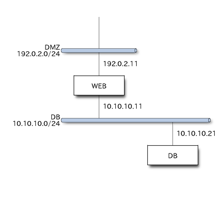

## システム概要

本書が対象とするシステムの概要を以下に示す。

### システムの名称

本書が対象とするシステムの名称は「魔法少女契約管理システム」（以下、本システム）とする。

### システムの目的

本システムは、インキュベーターによる魔法少女との契約に至る各プロセスの情報を管理し、希望と絶望の相転移によるエネルギーの効率的な抽出を支援することを目的とする。

### システムの特徴

本システムが提供する主な機能は以下の通り。

- 年度内のエネルギー抽出目標を設定し、目標に対する進捗管理可能とする。
- 魔法少女となりうる候補としての少女を登録し、少女が抱く希望の大きさを記録することで、抽出できるエネルギー量の見積を可能とする。
- 魔法少女契約締結までの交渉過程を記録することで、交渉手法の振り返りと改善を可能とする。
- 魔法少女契約後に少女が抱く絶望の大きさを記録することで、必要に応じて魔女化を後押しするなど時機を得た企画の立案を可能とする。

### 用語の定義

少女

:   本システムが管理対象とする少女を指す。

    30歳の魔法「少女」の存在も指摘されている[^overview-1]が、本システムでは年齢にかかわらず便宜的に「少女」の呼称で統一する。

    本システムにおける少女は、本システムの利用者たるインキュベーター氏がその存在を認識してからのち、契約の段階に応じて後述の通り「魔法少女候補」「魔法少女」「魔女」のように状態を変化させる。

魔法少女候補

:   魔法少女としての契約以前の状態にある少女を指す。

魔法少女

:   魔法少女としての契約済みの少女を指す。

魔女

:   ソウルジェムの穢れが一定のレベルを超え、魔女化した状態の魔法少女を指す。

    魔法少女が魔女化することで、見込まれていたエネルギーが抽出されたものとして実績値に加算される。

利用者

:   本システムを利用する主体となるインキュベーター氏を指す。

希望値

:   少女が持つ希望の度合いを数値化したもの。数値に単位の定義は無く、利用者がなんとなくフィーリングで入力する。

    少女の持つ希望の強さが高いほど、魔法少女契約を行う強いインセンティブを持つことになるため、契約確度を計るための指標となりうる。

    また、希望の強さは絶望の大きさに比例するため、魔女化した際に回収されるエネルギーの大きさを計る指標にもなりうる。

    ただし、特にこれといった希望が無いにも関わらず、かつて無いほどの魔法少女の素質を秘めている少女もいることから、希望値とは別に後述する`見込値`もあわせて記録する。

見込み値

:   少女から回収できると見込まれるエネルギーの度合いを数値化したもの。数値に単位の定義は無く、利用者がなんとなくフィーリングで入力する。

    魔女化した際に回収されるエネルギーの大きさを計る指標として、`希望値`とあわせて記録する。

穢れ値

:    ソウルジェムの穢れの度合いを数値化したもの。~~穢れが100pt貯まると次回ボーナスがエピソードor裏ボーナスとなる。~~ 魔女化する値を100とした相対値で表す。

    穢れ値が100を超えた時点で魔女化したものとし、見込み値を回収済みエネルギーの実績値に加算される。

### ネットワーク構成

本システムのネットワーク構成は以下の通り。

{width=400}

### 構成

本システムを構成する機能は以下の通り

- ダッシュボード
- 魔法少女登録・更新画面
- 魔法少女一覧画面
- 魔法少女詳細画面

[^overview-1]: [http://amzn.asia/7MwTr0U](http://amzn.asia/7MwTr0U)
