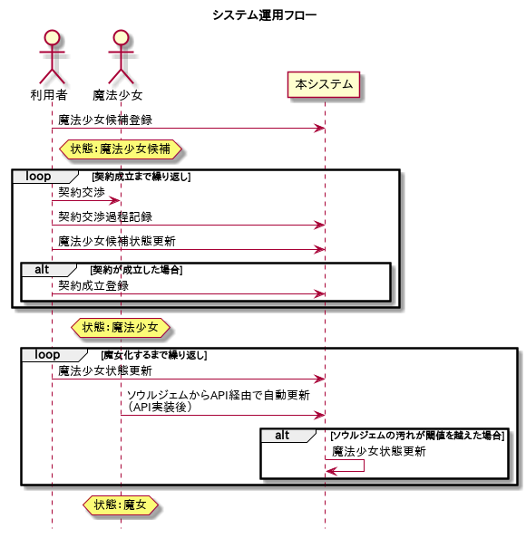

## システム運用フロー

本システムを用いた運用フローを以下に示す。

### 概要

本システムの運用フローの概要は以下の通り。各フェーズの内容については後述する。

本システムは以下のフェーズからなる。

**魔法少女候補登録**

利用者は魔法少女となる可能性を持った少女の存在を認めた場合、本システムから魔法少女候補として登録を行う。

登録の際、最終的に得られるエネルギーの見込み値や契約確度等を合わせて入力することで、当期の営業目標に対する進捗を可視化できる。

**契約交渉**

利用者は少女との契約交渉を行う。

**契約交渉過程記録**

利用者は少女に対する契約交渉の過程を随時登録する。

**魔法少女候補状態更新**

契約交渉過程において見込み値や契約確度に変化が認められた場合、利用者は本システムから速やかにパートナー候補のデータを更新する。

**契約成立登録**

魔法少女候補との契約が成立した場合、利用者は本システムから契約成立登録を行う。

契約成立登録を行った以降、魔法少女候補の状態は「魔法少女」となる。

**魔法少女状態更新**

利用者は個々の個体が担当する魔法少女の状態を管理し、ソウルジェムの穢れの状態などの変化を随時、本システムから更新する。

後日実装予定のAPIを通じて、ソウルジェムから自動的に状態を更新することも可能とする。

ソウルジェムがグリーフシード化した場合、本システムの管理上では魔女となり、エネルギー回収済みとして案件はクローズされる。（状態は「魔女」となる）

::: {custom-style="TipsInfo"}
本来、各個体が記憶を共有する利用者において、個別の交渉経緯を共有するための仕組みは不要であるが、交渉経緯を記録することによって将来的な交渉技術の改善に資することが期待できるため、交渉過程の記録は必須とする。
:::