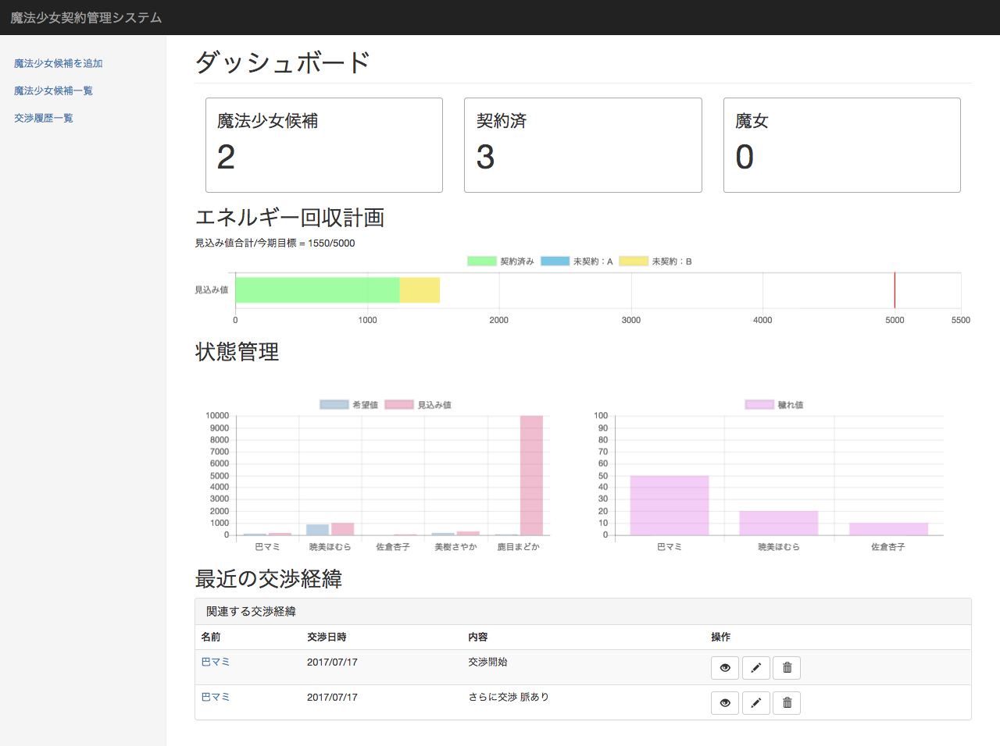

## ダッシュボード

本システムのダッシュボード画面の仕様を以下に示す。

### 概要

本画面は各少女の状態や、エネルギーの回収見込み値などを一望する機能を提供する。

### スクリーンショット

### 構成要素

本画面を構成する要素は以下の通り。

1. サマリー
2. エネルギー回収計画グラフ
3. 状態管理グラフ
4. 最新の交渉経緯

各要素の詳細は以下の通り。

#### 1. サマリー

サマリーには少女の状態別登録者数を表示する。

件数は以下の状態別に表示する。

- 魔法少女候補
    - ステータスが「候補」の少女の総数
- 契約済
    - ステータスが「契約済み」の少女の総数
- 魔女
    - ステータスが「魔女」の少女の総数

#### 2. エネルギー回収計画

今期のエネルギー回収目標に対する進捗を把握するためのグラフを表示する。

本項目には以下の情報を表示する。

1. 今期の達成目標
2. 上記に対する現在時点での見込み値の合計

上記の2については、以下の条件に該当する少女の見込み値の合計を表示する。

- ステータスが「契約済み」であるもの
- ステータスが「候補」でかつ「契約確度」がAまたはBであるもの

すでに契約済みか、確度の高い見込み値のみを表示することで、今期目標に対してより現実的な進捗を管理することを目的とする。

#### 3. 状態管理

登録された少女の状態を把握するためのグラフを表示する。

本項目には以下のグラフを表示する。

1. 少女ごとの希望値、見込み値のグラフ
2. 魔法少女ごとのソウルジェムの穢れ値のグラフ

1については、登録された少女のうちステータスが「候補」「契約済み」のいずれかの少女の情報を表示する。

2については、登録された少女のうちステータスが「契約済み」の少女の情報を表示する。

#### 4. 最新の交渉経緯

登録された交渉経緯を直近の5件まで表示する。

交渉経緯に表示される項目は以下の通り。

1. 名前
    - 交渉を行った少女の名前
    - 該当する魔法少女候補詳細画面へのリンクを付加する
2. 交渉日時
    - 交渉を行った日時
3. 内容
    - 交渉の内容
4. 操作
    - 対象の交渉履歴に対する操作（詳細・編集・削除）
