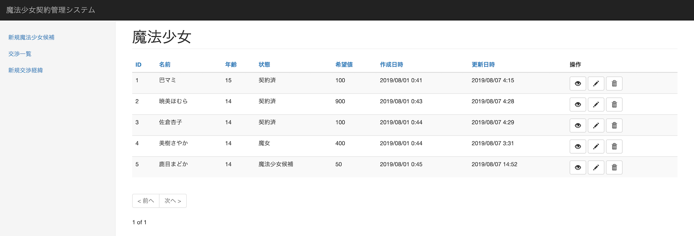

## 魔法少女一覧画面

魔法少女一覧画面の仕様を以下に示す。

### 概要

本画面は、システムに登録された少女の一覧を表示する。

### スクリーンショット

### 構成要素

本画面を構成する要素は以下の通り。

1. 魔法少女一覧テーブル

各要素の詳細は以下の通り。

#### 1. 魔法少女一覧テーブル

魔法少女一覧テーブルの項目は以下の通り。

1. **ID**

    少女を一意に識別するID

2. **名前**

    少女の名前

3. **年齢**

    少女の年齢[^1]

4. **状態**

    「ステータス一覧」を参照

5. **希望値**

    「用語の定義」を参照

6. **作成日**

    データが登録された日時

7. **更新日**

    データが更新された日時

8. **操作**

    データに対する操作を行う為のボタンを表示

    - 詳細
        - 魔法少女詳細画面に遷移
    - 編集
        - 魔法少女更新画面に遷移
    - 削除
        - 確認ダイアログを表示したのち、該当データを削除

[^1]: 本来であれば生年（月日）を登録して年齢は計算によって算出するべきであるが、2011年を起点としてその14〜15年前を誕生日として設定すると魔法少女がどんどん年を取ってしまうので年齢を入力することとした。
