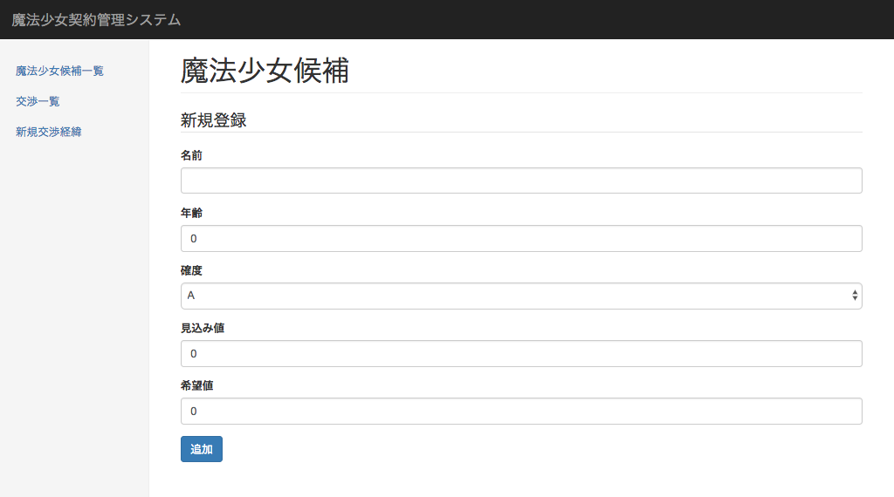

## 魔法少女登録・更新画面

魔法少女登録・更新画面の仕様を以下に示す。

### 概要

本画面は以下の目的のためのフォームを提供する。

- 少女を魔法少女候補として本システムに新規に登録する
- 登録された少女の情報を更新する

### スクリーンショット

### 構成要素

本画面を構成する要素は以下の通り。

1. 入力フォーム

各要素の詳細は以下の通り。

#### 1. 入力フォーム

本画面に表示する入力フォームは以下の通り。

| No | 項目     | 種別     | 長さ | 必須 |
|---:|:---------|:---------|-----:|:----:|
|  1 | 名前     | テキスト |   15 |  ○   |
|  2 | 年齢     | 数値     |    2 |  ○   |
|  3 | 確度     | リスト   |    2 |  ○   |
|  4 | 見込み値 | 数値     |    2 |  ○   |
|  5 | 希望値   | 数値     |    2 |  ○   |
|  6 | 穢れ値   | 数値     |    2 |  ○   |

1. 名前

    少女の氏名を入力する。

2. 年齢

    少女の年齢を入力する。

3. 確度

    契約交渉時の成約確度をリストから選択する。

    リストから選択出来る確度は以下の５段階とする。

    - A：成約確実
        - 対象者が明確に契約の意思を示した状態。
    - B：強い「願い」あり
        - 契約の動機となり得る強い「願い」がある状態。
    - C：「願い」あり
        - 漠然とした「願い」がある状態。
    - D：「願い」無し
        - 契約に対して明確な拒絶の意思は無いが、「願い」も無い状態。
    - E：契約意思無し
        - 契約に対して明確に拒絶の意思を示す状態。

4. 見込み値

    少女から最終的に得られると見込まれるエネルギー量を入力する。

    本入力欄は、担当者の主観に基づいて入力すること。

    本入力欄にて登録された値は、ダッシュボードの「エネルギー回収計画」の合計値に反映される。

5. 希望値

    少女が登録時点で抱く「希望」の度合いを入力する。

    本項目は「希望」が「絶望」に相転移した際に得られるエネルギー量を見積もるための指標として利用される。

6. 穢れ値

    ソウルジェムの穢れの度合いを示す値を入力する。

    本項目は状態が「契約済み」の場合にのみ表示される。

    本項目を100に設定して更新すると、状態が「魔女」に遷移する。
