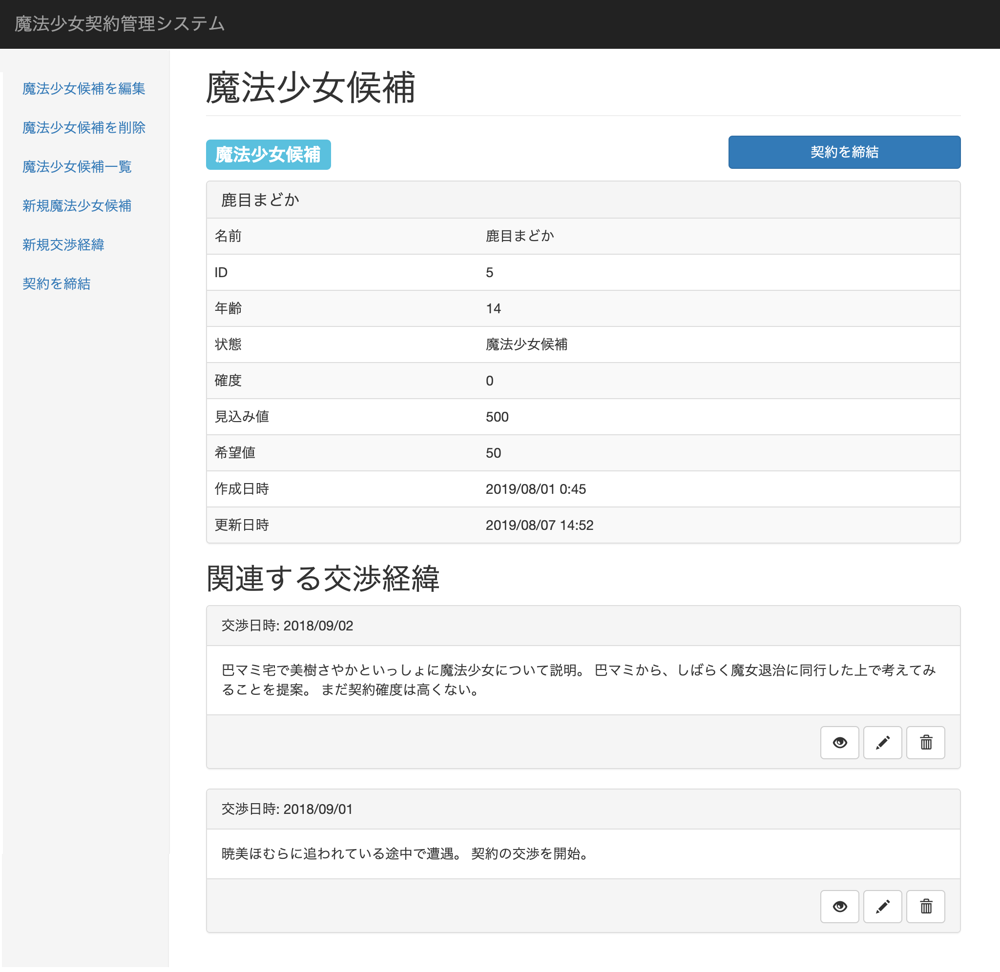
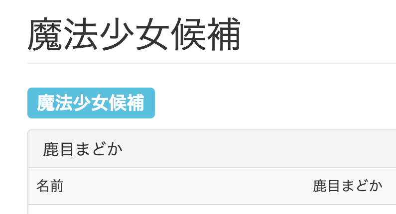
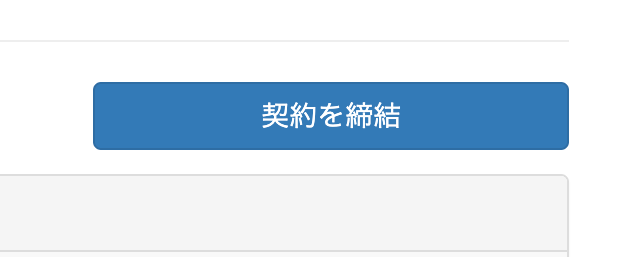

## 魔法少女詳細画面

魔法少女詳細画面の仕様を以下に示す。

### 概要

本画面は登録された少女に関する以下の情報を表示する。

- 登録された少女の情報
- 少女の状態
- 該当の少女に対する交渉の履歴

また、以下の操作を行うためのインターフェースを提供する。

- 少女の状態が「魔法少女候補」である場合、「契約を締結」ボタンを表示する。

### スクリーンショット

### 構成要素

本画面を構成する要素は以下の通り。

1. 状態表示
2. 「契約を締結」ボタン
3. 詳細情報
4. 関連する交渉経緯

各要素の詳細は以下の通り。

#### 1. 状態表示

画面上に、現在の少女の状態を表示する。

{width=300}

#### 2. 「契約を締結」ボタン

{width=300}

状態が「魔法少女候補」の場合、画面右上に「契約を締結」ボタンを表示する。

ボタンを押下すると、確認ダイアログを表示したのち、「OK」を押下した場合に状態が「契約済み」となる。

::: {custom-style=TipsDanger}
契約を締結する際は、重要事項の説明を必ず行うこと。
:::

#### 3. 詳細情報

詳細情報テーブルに表示する項目は以下の通り。

1. 名前

    少女の氏名を入力する。

2. ID

    少女を一意に特定するID。

3. 年齢

    少女の年齢を入力する。

4. 状態

    ステータス一覧を参照

5. 確度

    契約交渉時の成約確度をリストから選択する。

    リストから選択出来る確度は以下の５段階とする。

    - A：成約確実
        - 対象者が明確に契約の意思を示した状態。
    - B：強い「願い」あり
        - 契約の動機となり得る強い「願い」がある状態。
    - C：「願い」あり
        - 漠然とした「願い」がある状態。
    - D：「願い」無し
        - 契約に対して明確な拒絶の意思は無いが、「願い」も無い状態。
    - E：契約意思無し
        - 契約に対して明確に拒絶の意思を示す状態。

6. 見込み値

    少女から最終的に得られると見込まれるエネルギー量を入力する。

    本入力欄は、担当者の主観に基づいて入力すること。

    本入力欄にて登録された値は、ダッシュボードの「エネルギー回収計画」の合計値に反映される。

7. 希望値

    少女が登録時点で抱く「希望」の度合いを入力する。

    本項目は「希望」が「絶望」に相転移した際に得られるエネルギー量を見積もるための指標として利用される。

#### 4. 関連する交渉過程

該当する少女に対する交渉の履歴を降順で表示する。
